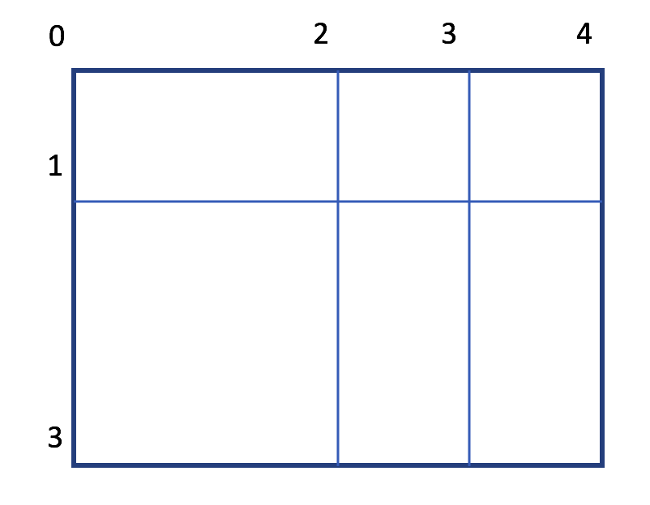
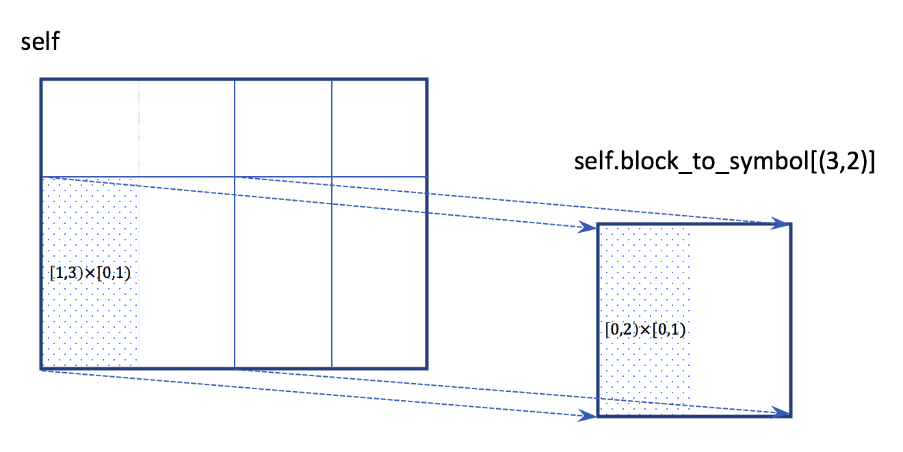
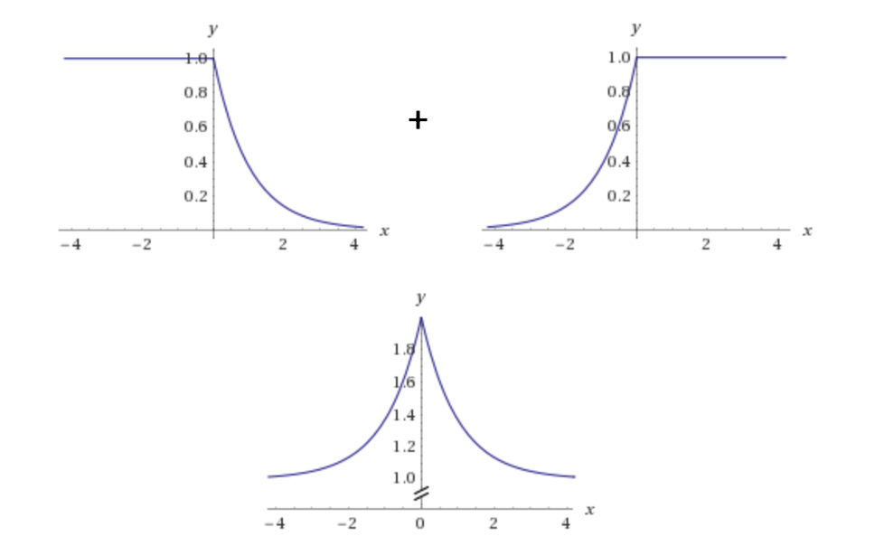

# Overview

We describe the functionality of each python source file and each folder in the followings:

* `analysis` folder contains the definition fo abstracted values and abstract interpretations for operations in computation graphs.

  * `abstract_interpretation.py` contains the class type of abstracted values that we use for our tensor abstraction and interval abstraction with affine relations.
  * `inference.py` contains the abstract interpretations for operations in computation graphs.

  For more information please see [Analysis](./analysis.md).

* `parse` folder contains the parsing process of the Protocol Buffer file to the computation graph, the process of static dataflow analysis, the parsing process of values, and the user-specified weights/inputs ranges.

  * `parse_graph.py` contains the parsing process of the Protocol Buffer file to the computation graph and the process of static dataflow analysis.
  * `parse_format_text.py` contains the parsing process of constant values, variables, and placeholders.
  * `specified_ranges.py` contains the reusable weights/inputs ranges specified by users.

  For more information please see [Parse](./parse.md).

* `analysis_main.py` is the entry of DEBAR. It takes one argument that is the target Protocol Buffer file containing the computation graph under verification. It also takes one option argument denoting  whether to specify the range of the weights and the range of the inputs. Please see **Running DEBAR** Section in [README](../README.md) for how the usage of DEBAR.
  The workflow of `analysis_main.py`:

  * First, it calls `parse_graph.py` to obtain the computation graph. 
  * Second, it scans the list of unsafe operations and calls the dataflow analysis in `parse_graph.py` to get the range of the input to the unsafe operations. 
  * Third, it checks whether the range of the input to the unsafe operation intersects with its danger zone.
    * If safe, then the unsafe operation is verified to be safe.
    * Otherwise, go to the next step.
  * Fourth, if  the range of input to the unsafe operation cannot be proved as safe, we will further split the ranges of some nodes using constant predicates such as 0. If all the splits of any node can prove the range of input to the unsafe operation does not intersect with its danger zone, then the operation is safe. The motivation and the details of predicate splitting can be found at **Predicate Splitting** Section.
    * If safe, then the unsafe operation is verified to be safe.
    * Otherwise, DEBAR generates a warning for the unsafe operation.

* `main.py` is the entry of reproducing the evaluation results reported in the paper. It takes one argument that is the path to the downloaded datasets.
  Please see **Reproduce Evaluation in our Paper** Section in [README](../README.md) for how to reproduce the evaluation results in our paper.

* `solver.py`

  * `Solver` is a legacy class that was used in z3-solver aided dataflow analysis. We are considering removing it because it is never used.

  * `Range` is a data structure for interval abstraction. `left` and `right` denote the lower and upper bound of the abstracted value.

  * `check_range_const(range_const)` checks whether a `Range` object `range_const` has const lower and upper bound. It is also a legacy function. Because we do not use z3-solver any more, the function should always return true, also considering removing it.

  * `meet(range, range_const)` checks whether the interval of `range` intersects with the interval of `range_const`. In other words, `meet` returns true iff `range` $\cap$ `range_const` $= \varnothing$. 
    `meet` will be called in `analysis_main.py` to check whether the interval bound of unsafe operations computed by static analysis intersects with their danger zone.

  * `Array` is the data structure supporting the tensor partitioning. It mainly contains:

    * `index_slices`: a list stores the partitioning positions of each dimension. If the tensor has dimension $d$ then `index_slices` contains $d$ tuples, each of which is the set of partitioning positions. If the $i$-th dimension is partitioned to $[0,p^{(i)}_0), [p^{(i)}_0,p^{(i)}_1), \dots, [p^{(i)}_{m-1},p^{(i)}_m)$, where $p^{(i)}_m$ is equal to the size of $i$-th dimension, then the $i$-th tuple of `index_slices` will be $(p^{(i)}_0,p^{(i)}_2,\ldots,p^{(i)}_m)$.
      

      For example, a two-dimension tensor (matrix) A has the shape $3\times 4$ and it is partitioned into 6 partitions $[0,1)\times [0,2)$,  $[0,1)\times [2,3)$, $[0,1)\times [3,4)$, $[1,3)\times [0,2)$,  $[1,3)\times [2,3)$, $[1,3)\times [3,4)$. Then the `index_slices` will be `[(1, 3), (2, 3, 4)]`.

    * `block_to_symbol`: a map maps from each partition to a `Linear` object, which maintains the linear affine relation. Each partition is defined by the Cartesian product of $d$ tuples in  `index_slices`, called **partitioning positions**.

      Taking the above example, the keys of the map `block_to_symbol` will be a set of 6 $2$-tuples: $(1,2),(1,3),(1,4),(3,2),(3,3),(3,4)$, each of which denotes the ending points of partitions in all dimensions.

    * `join_index_slices(a, b)` aligns two sets of partitioning positions `a` and `b`. Both `a` and `b` are in the form of `Array.index_slices`.

      For example, suppose `a = [(1,3), (2,3,4)]` and `b=[(3), (1,4)]`, then the aligned partitioning positions `c` will be `[(1,3), (1,2,3,4)]`. It can be seen that `c` has a finer granularity of partitioning than `a` and `b` in this case.

    * `get_corresponding_keys(self, index_slices)` gets the corresponding `Linear` objects according to `index_slices`. Notice that `index_slices` may have a finer granularity of partitioning than `self.index_slices`, so the `Linear` object (as well as the variables stored in the `Linear` object) may need to be further partitioned.
      

      For example, suppose `self.index_slices=[(1, 3), (2, 3, 4)]` and `index_slices = [(1, 3), (1, 2, 3, 4)]`, then the partition $[1,3)\times[0,1)$ corresponds to the partition $[0,2)\times[0,1)$  of `self.block_to_symbol[(3,2)]`.

  * `Linear` is the data structure supporting the linear affine relation. For example, considering the following affine relation:
    $$
    3x-relu(x)+4y-z+5=0.
    $$
    Each `Linear` object has a main variable, because each `Linear` object is stored in the `block_to_symbol` field in an `Array` object, and the `Array` object is the abstracted value of the main variable. For example, $z$ may be the main variable in the above affine relation, then what is stored in the `Linear` object is the following **affine expression**:
    $$
    3x-relu(x)+4y+5,
    $$
    whose semantics is $z=3x-relu(x)+4y+5$, where $z$ is omitted since it can be inferred since $z$ is the main variable.

    In order to store such affine expression, `Linear` uses:

    * `value`: a map maps from variables to their factors. Taking the above example, `value[x] = 3`, `value[relu(x)] = -1`, `value[y] = 4`, and `value[CONST] = 5`.
      And each variable is a partition of  a tensor which is the output of one operation. The variable is defined as a pair of `(name, indexes)`, where the `name` is the name of the operation, and `indexes` is the partitioning positions.

    * `map_to_index`: a map maintains an index mapping. The purpose of maintaining this index mapping is that additional dimensions may be added after operations like `pack` , the dimensions may be deleted  (these dimensions are all equal to 1 and do not change the size of the partition) after operations like `unpack`, the dimensions may be permuted after operations like `transpose`.
      Considering the following code:

      ```python
      z = transpose(x) 
      ```

      , where `z` is a matrix $3\times 4$ and `x` is a matrix $4 \times 3$. Suppose there is only one (whole) partition of `z`, then the tensor partition `Array` of `z` contains `index_slices=[(3,), (4,)]` and `block_to_symbol=[(3,4)]` maps to the linear affine expression `x`, where the partition positions of `x` are `[(4,), (3,)]`. Notice that the 0-th dimension of `z` is the 1-th dimension of `x` and the 1-th dimension of `z` is the 0-th dimension of `x`. 

      The semantics of `map_to_index` is that `z[t]` corresponds to `x[map_to_index[t]]`.

    * `__add__(self, other)`, `__sub__(self, other)`: adds/subs between two affine expressions and returns a new `Linear` object.

    * `neg(self)`: calculates the negation of the affine expression.

    * `choose(self, start_ind)`: further partitions the variables inside the `Linear` object and returns a new partitioned `Linear` object. Recall in `Array.get_corresponding_keys`, we may further partition the `Linear` object as well as the variables stored in the `Linear` object.

    * `add_pack_ind(self, pack_ind)`: adds an axis at the `pack_ind`-th dimension and returns a new packed `Linear` object.

    * `remove_unpack_axis(self, axis)`: removes an axis at the `axis`-th dimension and returns a new unpacked `Linear` object.

    * `transpose(self, perm)`: transposes the ``map_to_index`` according to the permutation `perm` and returns a new transposed `Linear` object.

    * `relu(self)`: calculates the $relu$ of the affine expression and returns a new `Linear` object. It only supports calculating the relu of a singleton affine expression that only contains one variable or one constant value, e.g., `x`, `-x`, `relu(x)`, `-relu(x)`, and constant value `c`.
      The following axioms are used to calculate $relu$:
      $$
      relu(x)=relu(x)\\
      relu(-x)=-x+relu(x)\\
      relu(relu(x))=relu(x)\\
      relu(-relu(x))=0\\
      relu(c)=max(c,0)
      $$

  * `meet_relation_variable(rv, range_const)` is never used, also considering removing it.

* `utils.py` 

  * `OVERFLOW_LIMIT`, `UNDERFLOW_LIMIT`, `OVERFLOW_D`, and `UNDERFLOW_D` specify the overflow and underflow limit in `tf.float32`. 
  * `resolve_type(y)` converts `y` from data types in `numpy`  to python primitive data types.
  * `shape_from_proto(shape)` parses the tensor shape from protocol buffer format `shape` into a python list.

## Predicate Splitting

The workflow of `analysis_main.py` has been described previously. We further describe the motivation and the details of predicate splitting.

### Motivation

Considering the following expression:
$$
y = e^{-relu(x)} + e^{x-relu(x)}
$$


### 

The range of $y$ is $(1,2]$ if the range of $x$ is $[-50,40]$. Using the interval abstraction with affine relation, we are able to calculate the range of $-relu(x)$ is $[-40,0]$ and the range of $x-relu(x)$ is $[-50,0]$. Then the range of $e^{-relu(x)}$ is $[0,1]$ and the range of  $e^{x-relu(x)}$  is $[0,1]$, leading the range of $y$ to be $[0,2]$. 

The range of $y$ is an over-approximation because $e^{-relu(x)}$ is decreasing and $e^{x-relu(x)}$ is increasing. Besides, due to the nonlinearity of the exponential function, affine relation alone cannot eliminate the over-approximation of $y$. However, we can infer that $y$ depends on $x$ nonlinearly. 

When we find out a variable $y$ is depends on another variable $x$  nonlinearly, we apply the **predicate splitting** technique, which further splits the range of $x$ according to some constant predicates like 0, and then merge the ranges of $y$ to get a preciser result. 

In this case, if we split the range of $x$ to $[-50, 0]\cup [0, 40]$. 

*  $x=[-50,0]$:  we are able to calculate the range of $-relu(x)$ is $[0,0]$ and the range of $x-relu(x)$ is $[-50,0]$. Then the range of $e^{-relu(x)}$ is $[1,1]$ and the range of  $e^{x-relu(x)}$  is $[0,1]$, leading the range of $y$ to be $[1,2]$. 
* $x=[0,40]$:  we are able to calculate the range of $-relu(x)$ is $[-40,0]$ and the range of $x-relu(x)$ is $[0,0]$. Then the range of $e^{-relu(x)}$ is $[0,1]$ and the range of  $e^{x-relu(x)}$  is $[1,1]$, leading the range of $y$ to be $[1,2]$. 

After merge the two ranges of $y$, we get the precise range $[1,2]$.

### Details

For each unsafe operation under verification, `analysis_main.py` first calls `graph.forward_analysis` in `parse_grahp.py` to get the dataflow analysis results of the computation graph. The analysis results are stored in `graph.node_output`, and the return values of `graph.forward_analysis` contain the ranges of node needed to be split `range_to_split`.

Function `is_valid_by_split` checks whether the unsafe operation's input is valid. It first checks whether the input ranges of the unsafe operation is valid without without predicate splitting, if false, it tries to split each node in `range_to_split` and reevaluate the dataflow analysis in an incremental manner by calling `graph.reevaluate`. If the merged result of any split node is valid, then the input ranges of the unsafe operation is proved to be valid.

Theoretically, the more splits we try the preciser results we will get. In the implementation, we only try to split the range into two splits and the constant predicate is always 0.

